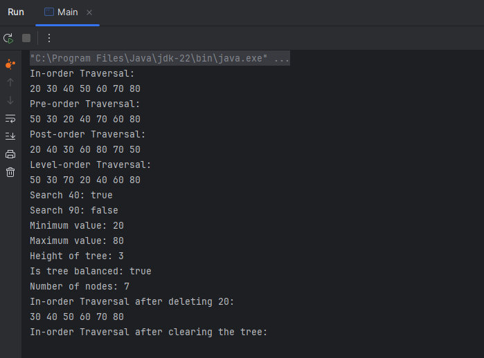
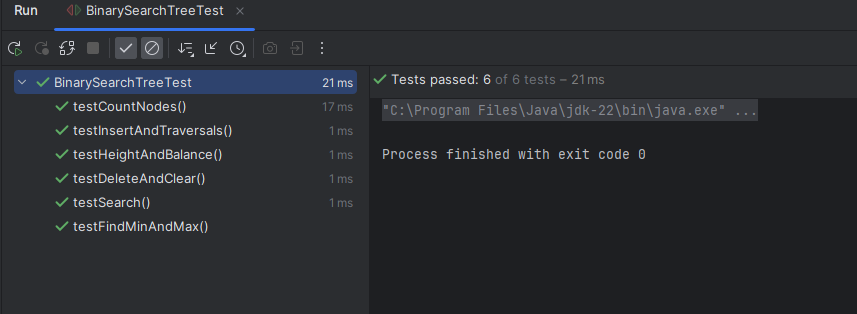

# AREP_Binary_search_tree

## Overview

This project implements a Binary Search Tree (BST) in Java. A BST is a data structure that organizes data hierarchically, allowing for efficient insertion, deletion, and lookup operations. The BST follows two key properties:
1. The value of every node in the left subtree is less than the value of the node itself.
2. The value of every node in the right subtree is greater than the value of the node itself.

These properties ensure that search operations can be performed in O(log n) time on average, making BSTs an efficient choice for storing and retrieving ordered data.
## Architecture

The main components of the Binary Search Tree (BST) implementation are:

1. **Node Class**: Represents a single node in the BST, containing a value and references to its left and right children.
2. **BinarySearchTree Class**: Manages the overall structure of the BST and provides methods for insertion, deletion, search, and traversal.
3. **Test Class**: Contains unit tests to verify the functionality of the BST implementation.

## Requirements

To run this application, you need the following software installed:

- **Java Development Kit (JDK)**: Version 8 or higher.
- **IntelliJ IDEA**: Version 2023.2.7 or higher.
- **JUnit 5**: For running the test cases.
- Download the JUnit .jar file from the official JUnit website and add the JUnit .jar to your project’s build path. You can do this by:
  - Right-click on the project in your IDE (e.g., Eclipse, IntelliJ).
  - Navigate to Build Path > Configure Build Path.
  - Click on Libraries and add the JUnit .jar file you downloaded.

Ensure that your environment is set up with these versions to avoid compatibility issues.
## Features

The implementation includes several fundamental functions to manage and traverse the tree effectively:

1. **Insertion (insert)**: Adds a new node to the tree while maintaining the binary tree properties.

2. **Search (search)**: Finds and returns a node containing a specific value.

3. **Deletion (delete)**: Removes a node with a specified value from the tree while maintaining its structure and properties. This function handles three cases:
    - The node to be deleted is a leaf node (no children).
    - The node has only one child.
    - The node has two children.

4. **Traversal Methods**: These functions are used to visit all the nodes in the tree in a specific order:
    - **In-order Traversal (inOrderTraversal)**: Visits nodes in ascending order (left, root, right).
    - **Pre-order Traversal (preOrderTraversal)**: Visits the root first, followed by the left subtree and then the right subtree (root, left, right).
    - **Post-order Traversal (postOrderTraversal)**: Visits the left and right subtrees before the root (left, right, root).

5. **Find Minimum (findMin)**: Finds and returns the node with the smallest value in the tree.

6. **Find Maximum (findMax)**: Finds and returns the node with the largest value in the tree.

7. **Height (height)**: Calculates and returns the height (or depth) of the tree, which is the number of edges from the root to the deepest leaf.

8. **Check if the Tree is Balanced (isBalanced)**: Determines if the tree is balanced, meaning the heights of the two child subtrees of any node differ by no more than one.

9. **Level-Order Traversal (levelOrderTraversal)**: Visits all nodes at each level of the tree, starting from the root, then level 1, level 2, and so on.

10. **Clear (clear)**: Removes all nodes from the tree, making it empty.

11. **Count Nodes (countNodes)**: Returns the number of nodes currently present in the tree.
## Start
Install git and clone the repository
```bash
git clone https://github.com/JuanalvarezECI/AREP_Binary_search_tree
```
Open the project in IntelliJ IDEA and run the main method in the App class to start the application. You can also run the test cases in the Test class to verify the functionality of the BST implementation.

## Testing

The implementation is tested with various inputs to ensure that all methods function as expected. The tests include:
- Inserting multiple values into the BST.
- Performing different types of traversals.
- Searching for specific values.
- Finding the minimum and maximum values.
- Checking the height and balance of the tree.
- Counting the number of nodes.
- Deleting nodes and verifying the tree structure.
- Clearing the tree and ensuring it is empty.


## Conclusion

This project provides a comprehensive implementation of a Binary Search Tree in Java, compatible with the Java Collections API. It includes all essential functions for managing and traversing the tree, ensuring efficient operations for insertion, deletion, and lookup.
